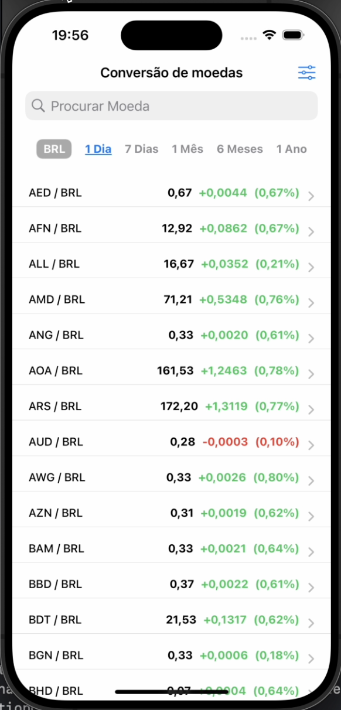
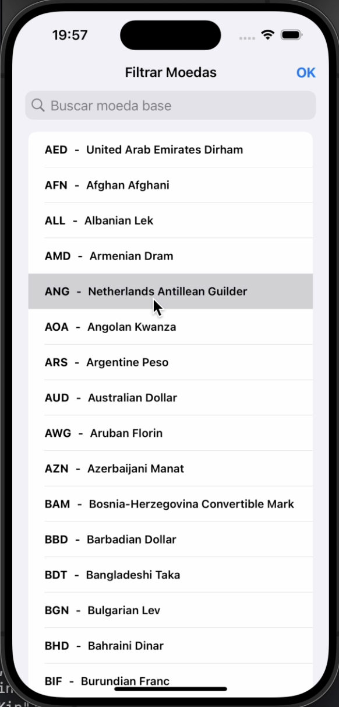
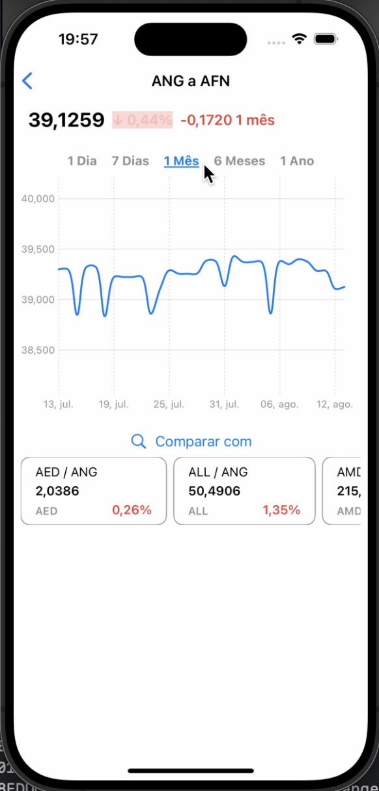

# ExchangeApp
Aplicativo que lista e gerencia Moedas consumindo a Api https://exchangeratesapi.io/

# Funcionalidades
- Listagem de criptomoedas
- Filtro de Moedas
- Graficos
- Comparação de Moedas

# Tecnologias utilizadas
- Swift
- MVVM
  
- UiState
- Requisições HTTP
- Charts
- Combine
## Layout mobile

  
  
  
 

